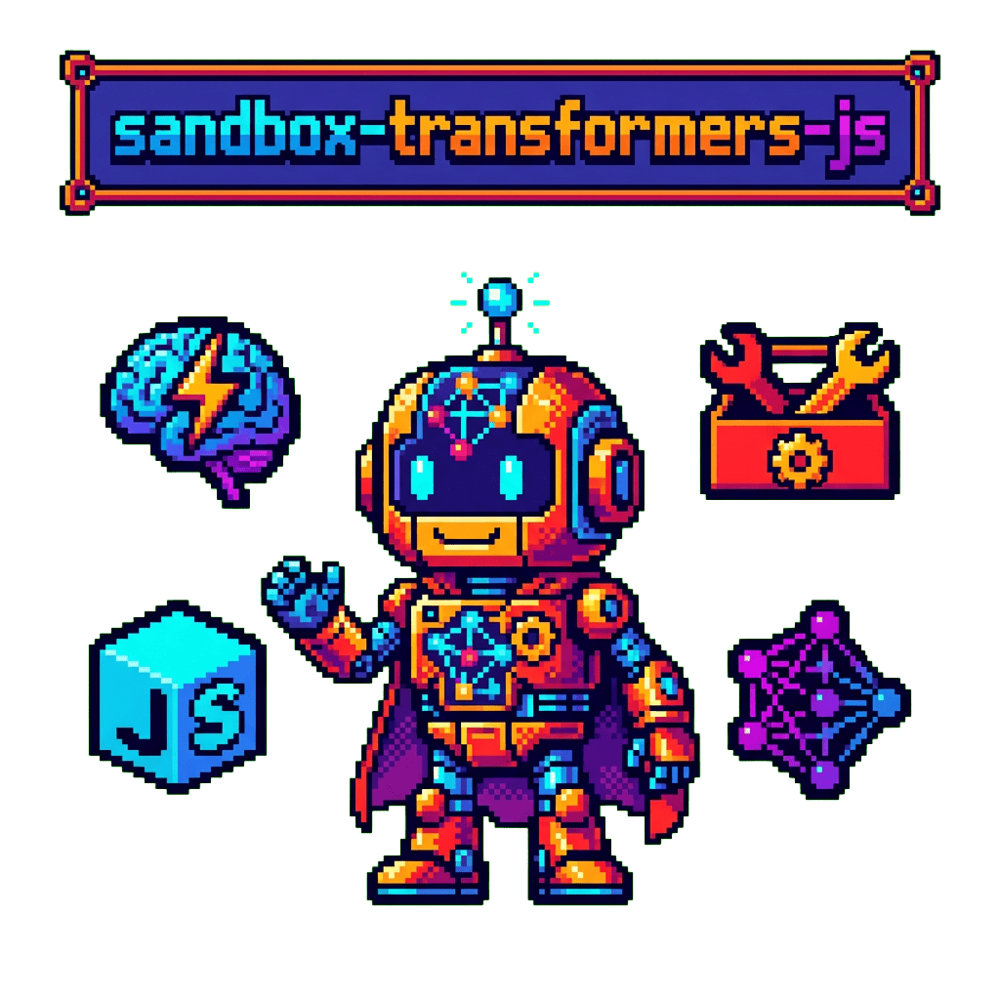

  

  # sandbox-transformers-js

  

  **A sandbox for experimenting with Transformers.js - running ML models in the browser and Node.js**

## Overview

This repository is a personal playground for exploring [Transformers.js](https://huggingface.co/docs/transformers.js), the JavaScript/TypeScript library that brings state-of-the-art machine learning models to the browser and Node.js environments.

## What is Transformers.js?

Transformers.js enables running pre-trained models directly in JavaScript without requiring a Python backend. It supports:

- Text classification and sentiment analysis
- Named entity recognition
- Question answering
- Text generation
- Image classification
- Object detection
- Speech recognition
- And more...

## Project Status

This project is in early development. Check back for experiments and examples as they are added.

## License

[MIT](LICENSE)